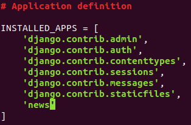
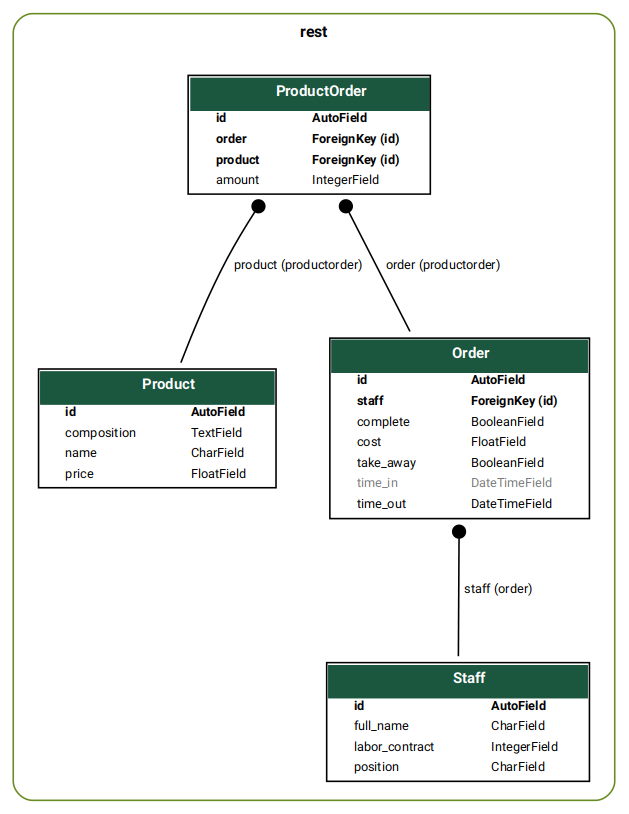

Создаём виртуальное окружение:
### python -m venv venv

Заходим в него:
### venv\scripts\activate

Устанавливаем Django в свежее виртуальное окружение:
### py -m pip install Django==5.2.1

И запускаем команду создания проекта:
### py -m django startproject project

Переходим в директорию проекта:
### cd project

Здесь файл manage.py, который является точкой входа для управления проектом.

Также через консоль запустим следующую команду, 
которая создаст новое приложение news.
### py manage.py startapp simpleapp

### Перейдем в файл project/settings.py 
### и найдём там список INSTALLED_APPS:

Здесь мы должны добавить новый элемент в этот список 
— строку с названием приложения, ('simpleapp')
которое совпадает с названием директории. 
Это позволит Django обнаружить созданное нами приложение.

### Добавил приложению модели simpleapp/models.py
Обратите внимание, что мы дополнительно 
указали методы __str__ у моделей. 
Django будет их использовать, когда потребуется 
где-то напечатать наш объект целиком. 
Например, в панели администратора или в темплейте. 
Вот как раз для вывода в HTML странице мы и указали, 
как должен выглядеть объект нашей модели.

### Зарегистрировал модели для приложения, simpleapp/admin.py (иначе мы не увидим их в админке)

### Написал представление для приложения, simpleapp/views.py

### Настроил адрес, для представления приложения, создав файл simpleapp/urls.py
чтобы любой пользователь приложения мог ознакомиться с товарами. 
Для этого необходимо настроить пути в файле urls.py. 
При выполнении команды инициализации нового приложения Django 
не создавал этот файл в нашей директории, 
поэтому сделал сам. 

Запустить сервер
### py .\manage.py runserver

Команда для создания миграций в Django,
### py manage.py makemigrations
запускает скрипт, который проходиться по всем классам,
от наследованного models.Mogel и смотрит были внесены какие-то изменения,
когда добавил в файл NewsPaper/news/models.py (приложение) информацию об БД

Применение миграции
### py .\manage.py migrate
- иногда после применения миграции возникают ошибки, кажется с начало вс ок, 
  но потом вываливаются ошибки, 
  нужно просто удалить в БД таблицу django_session, 
  и применить миграцию ошибки исчезнут

  
Если возникает ошибки с БД в частности с моделями, то можно просто откатиться:
- Удалить файл - 0001_initial.py (NewsPaper/news/migrations/0001_initial.py)
- В БД удалить таблицы который создали, (приложение DBeaver)
- В БД переходим в таблицу django_migrations,  (приложение DBeaver)
|    - нажимаем на | Данные |  (приложение DBeaver)
|    - удаляем последнюю строчку записи (нажимаем на строку слева и на кнопку |-| (удалить запись внизу))  (приложение DBeaver)
|    - обновляем/сохраняем таблицу (приложение DBeaver)

- иногда после применения миграции возникают ошибки, кажется с начало вс ок, 
|    - но потом вываливаются ошибки, 
|    - нужно просто удалить в БД таблицу django_session, (приложение DBeaver)
|    - и применить миграцию ошибки исчезнут 

### Структура моделей models.py (NewsPaper/news/models.py)

echo "# django_views" >> README.md
git init
git add README.md
git commit -m "first commit"
git branch -M master
git remote add origin https://github.com/DS-975/django_views.git
git push -u origin master