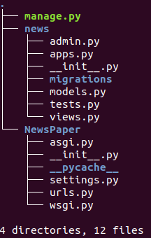

Создаём виртуальное окружение:
### python -m venv venv

Заходим в него:
### venv\scripts\activate

Устанавливаем Django в свежее виртуальное окружение:
### py -m pip install Django==5.2.1

И запускаем команду создания проекта:
### py -m django startproject project

Переходим в директорию проекта:
### cd project

Здесь файл manage.py, который является точкой входа для управления проектом.

Также через консоль запустим следующую команду, которая создаст новое приложение news.
### py manage.py startapp simpleapp

Здесь мы использовали команду startapp из скрипта manage.py. 
В качестве параметра этой команды мы должны указать название нового приложения — news. 
Мы можем увидеть новую директорию, в которой есть большое количество файлов.

Django автоматически создал основные необходимые файлы для нового приложения. 
Чтобы это приложение стало частью этого проекта, мы должны его добавить в установленные приложения.

### Перейдем в файл NewsPaper/settings.py 
### и найдём там список INSTALLED_APPS:

Здесь мы должны добавить новый элемент в этот список — строку с названием приложения, которое совпадает с названием директории. Это позволит _Django_ обнаружить созданное нами приложение.

Запустить сервер
### py .\manage.py runserver

Команда для создания миграций в Django, 
запускает скрипт, который проходиться по всем классам,
от наследованного models.Mogel и смотрит были внесены какие-то изменения,
когда добавил в файл NewsPaper/news/models.py (приложение) информацию об БД
### py manage.py makemigrations

Применение миграции
### py .\manage.py migrate
- иногда после применения миграции возникают ошибки, кажется с начало вс ок, 
  но потом вываливаются ошибки, 
  нужно просто удалить в БД таблицу django_session, 
  и применить миграцию ошибки исчезнут

Если возникает ошибки с БД в частности с моделями, то можно просто откатиться:
- Удалить файл - 0001_initial.py (NewsPaper/news/migrations/0001_initial.py)
- В БД удалить таблицы который создали, (приложение DBeaver)
- В БД переходим в таблицу django_migrations,  (приложение DBeaver)
|    - нажимаем на | Данные |  (приложение DBeaver)
|    - удаляем последнюю строчку записи (нажимаем на строку слева и на кнопку |-| (удалить запись внизу))  (приложение DBeaver)
|    - обновляем/сохраняем таблицу (приложение DBeaver)

- иногда после применения миграции возникают ошибки, кажется с начало вс ок, 
|    - но потом вываливаются ошибки, 
|    - нужно просто удалить в БД таблицу django_session, (приложение DBeaver)
|    - и применить миграцию ошибки исчезнут 

### Структура моделей models.py (NewsPaper/news/models.py)
